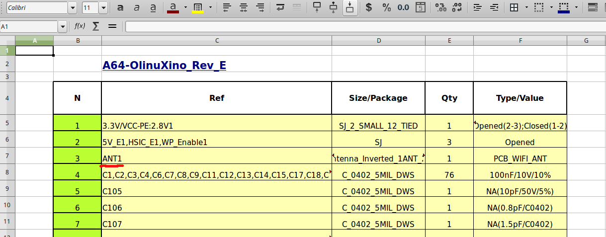

# KiCad Better BOM

Bill of material (BOM) generation feature of [KiCad](http://kicad-pcb.org/) leaves much to be desired.
The most important flaw of it is that it does not support *any* kind of workflow. The typical process
looks like this: edit PCB, generate BOM, import BOM into spreadsheet, edit BOM, edit PCB, etc.

This BOM generator has been designed with workflow in mind and it (mostly) supports more convenient
process, like: edit PCB, prepare config file, generate XLSX, edit PCB, generate XLSX, etc.

All typical changes to the resulting document are permanently stored in a config file. Let's see how
it works.

## Installation

This program requires [Python3](http://python.org)  and one additional dependency, xlsxwriter.
Install Python as described on the site and then install xlsxwriter by typing

    pip3 install --user xlsxwriter

That's all. 

## Basic use

Now let's download a free KiCad project [Olinuxino](https://github.com/OLIMEX/OLINUXINO/tree/master/HARDWARE/A64-OLinuXino)
selected just because it is large enough, and run the following command in the project directory:

    python3 path/to/kicad_bom.py

You're done! Here is the first BOM you generated. Open XLSX file using Excel or LibreOffice.
We will use the project **A64-OlinuXino_Rev_E ** from now on. Now, what's this:

It is PCB antenna, and we have no reason to include it in component list. Now make a file named `bom.cfg` in
the same directory where the KiCad project is. Put the following lines there:

~~~config
[ignore]
reference(ANT1)
~~~

Run the program again. Look, no more ANT1. It is possible to use regular expressions in the parentheses,
so if we had several antennas, we could use 

    reference(ANT\d+)

instead. Now let's introduce some terminology. Each component has several properties: `reference`, `package`, `value`,
`library` (where this component came from), `side`. Each of these properties could be used in `[ignore]`  and other sections
of `bom.cfg`. For example, to ignore all measurement points, one can use

~~~config
[ignore]
library(Measurement_Points)
~~~

Please note that all these names are case-sensitive. The program automatically ignores components with no references and with
'~' references. It reports all components that are ignored, except for empty references. Thus it is possible to be sure that
your regular expressions are not too smart and there are no necessary components ignored.

Now let's note that default column widths are not perfect for this project. The Type/Value column is too narrow. No problem.

~~~config
[columns]
col1=N:n
col2=Ref:reference
col3=Size/Package:package
col4=Qty:quantity
col5=Type/Value:value:30
~~~

Columns are described as Name:property:width, width can be omitted, in which case default value will be used. Also
this feature allows to assign arbitrary names to columns, i.e. in national language.

It is also possible to create additional columns without contents, for later use. 

~~~config
col6 = Supplier
col7 = Price
col8 = Comment
~~~

## Renaming packages

Another important feature is package renaming. Many package names in KiCad have names with some special meanings, like
`C_0402_5MIL_DWS` or `D_SOT-23_ANK` vs `D_SOT-23_NKA`. Component supplier will seldom need this NKA or ANK parts.
So, the next section of the config allows to rename packages, like this:

~~~config
[packages]
D_SOD-323 = SOD-323
LQFP-48.* = LQFP-48
C_0402_5MIL_DWS = C_0402
D_SOT-23_ANK = SOT-23
~~~

and so on. Again, regular expressions can be useful. 

## Advanced usage: categories

Separating the BOM to categories like resistors, capacitors, connectors etc. is useful, it makes your document
even more nice-looking, but the most important is that it allows you to make less mistakes. Introducing categories
is simple - just add `[categories]` section to bom.cfg

~~~config
[categories]
value(1N7002) = transistors
reference(LED.+) = leds
reference(D.+) = diodes
reference(J.+) = connectors
reference(SW1) = pushbuttons
~~~

As with ignore, it is possible to use all properties for classification. So far, not very useful, however the category
is a property, and it can be added to columns:

~~~config
col6=Element type:category
~~~

If there is no category defined for the component, the corresponding field will be empty. By assigning categories to 
components, it is possible to be sure that all components were considered, thought of, and classified (at least).
It is also possible to split the BOM into sections according to the categories. Once more time: category is the property
of the component, while section is a feature of the spreadsheet table. 

~~~config
[sections]
resistors = Resistors
capacitors = Capacitors
transistors = Transistors
diodes = Diodes
~~~

Here the syntax is `category_name = Section_Header`. Everything that is not categorized appears at the end of the list
**in ugly form**. 

## Rules

If you introduce `[columns]`, you **must** specify all columns, their headers and contents.
If you introduce `[sections]`, you **must** provide categories for all components (except for those that are ignored)

